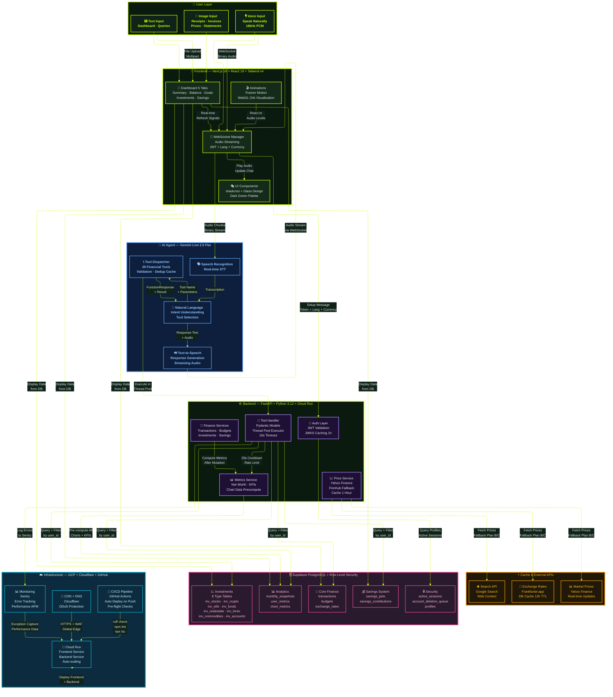

# Finrush System Architecture

```mermaid
---
config:
  theme: neo-dark
  themeVariables:
    primaryColor: '#0f2318'
    primaryTextColor: '#e5e7eb'
    primaryBorderColor: '#C8FF00'
    lineColor: '#C8FF00'
    secondaryColor: '#0a1a0f'
    tertiaryColor: '#1a0d2e'
    clusterBkg: '#0a1a0f'
    clusterBorder: '#C8FF00'
    edgeLabelBackground: '#0f2318'
    fontFamily: 'system-ui, -apple-system, sans-serif'
  layout: elk
---
flowchart TB
  subgraph USER["👤 User Layer"]
    A["🎙️ Voice Input<br/>Speak Naturally<br/>16kHz PCM"]
    B["📸 Image Input<br/>Receipts · Invoices<br/>Prices · Statements"]
    C["⌨️ Text Input<br/>Dashboard · Queries"]
  end

  subgraph FRONT["🎨 Frontend — Next.js 16 + React 19 + Tailwind v4"]
    D["🔌 WebSocket Manager<br/>Audio Streaming<br/>JWT + Lang + Currency"]
    E["📱 Dashboard 5 Tabs<br/>Summary · Balance · Goals<br/>Investments · Savings"]
    F["🎭 UI Components<br/>shadcn/ui + Glass Design<br/>Dark Green Palette"]
    G["🎬 Animations<br/>Framer Motion<br/>WebGL Orb Visualization"]
  end

  subgraph AGENT["🧠 AI Agent — Gemini Live 2.5 Flash"]
    H["🗣️ Speech Recognition<br/>Real-time STT"]
    I["🤖 Natural Language<br/>Intent Understanding<br/>Tool Selection"]
    J["📞 Tool Dispatcher<br/>29 Financial Tools<br/>Validation · Dedup Cache"]
    K["🔊 Text-to-Speech<br/>Response Generation<br/>Streaming Audio"]
  end

  subgraph BACK["⚙️ Backend — FastAPI + Python 3.12 + Cloud Run"]
    L["🔐 Auth Layer<br/>JWT Validation<br/>JWKS Caching 1h"]
    M["📊 Metrics Service<br/>Net Worth · KPIs<br/>Chart Data Precompute"]
    N["💼 Tool Handler<br/>Pydantic Models<br/>Thread Pool Executor<br/>10s Timeout"]
    O["🏦 Finance Services<br/>Transactions · Budgets<br/>Investments · Savings"]
    P["📈 Price Service<br/>Yahoo Finance<br/>Finnhub Fallback<br/>Cache 1 Hour"]
  end

  subgraph CACHE["⚡ Cache & External APIs"]
    Q["💱 Exchange Rates<br/>Frankfurter.app<br/>DB Cache 12h TTL"]
    R["📊 Market Prices<br/>Yahoo Finance<br/>Real-time Updates"]
    S["🌐 Search API<br/>Google Search<br/>Web Context"]
  end

  subgraph DB["🗄️ Supabase PostgreSQL + Row-Level Security"]
    T["💸 Core Finance<br/>transactions<br/>budgets<br/>exchange_rates"]
    U["💰 Savings System<br/>savings_pots<br/>savings_contributions"]
    V["📈 Investments<br/>8 Type Tables<br/>inv_stocks · inv_crypto<br/>inv_etfs · inv_funds<br/>inv_realestate · inv_forex<br/>inv_commodities · inv_accounts"]
    W["📊 Analytics<br/>monthly_snapshots<br/>user_metrics<br/>chart_metrics"]
    X["🔒 Security<br/>active_sessions<br/>account_deletion_queue<br/>profiles"]
  end

  subgraph INFRA["☁️ Infrastructure — GCP + Cloudflare + GitHub"]
    Y["🚀 Cloud Run<br/>Frontend Service<br/>Backend Service<br/>Auto-scaling"]
    Z["🔄 CI/CD Pipeline<br/>GitHub Actions<br/>Auto Deploy on Push<br/>Pre-flight Checks"]
    AA["📡 CDN + DNS<br/>Cloudflare<br/>DDoS Protection"]
    AB["📊 Monitoring<br/>Sentry<br/>Error Tracking<br/>Performance APM"]
  end

  USER -->|"WebSocket<br/>Binary Audio"| D
  USER -->|"File Upload<br/>Multipart"| E
  A --> D
  B --> E
  C --> E

  D -->|"Setup Message<br/>Token + Lang + Currency"| L
  E -->|"Real-time<br/>Refresh Signals"| D
  E -->|"Display Data<br/>from DB"| T & U & V & W

  G -->|"React to<br/>Audio Levels"| D

  D -->|"Audio Chunks<br/>Binary Stream"| H
  H -->|"Transcription"| I
  I -->|"Tool Name<br/>+ Parameters"| J
  J -->|"Execute in<br/>Thread Pool"| N

  N -->|"Query + Filter<br/>by user_id"| T & U & V & W
  O -->|"Compute Metrics<br/>After Mutation"| M
  P -->|"Fetch Prices<br/>Fallback Plan B/C"| Q & R & S

  J -->|"FunctionResponse<br/>+ Result"| I
  I -->|"Response Text<br/>+ Audio"| K
  K -->|"Audio Stream<br/>via WebSocket"| D
  D -->|"Play Audio<br/>Update Chat"| F

  L -->|"Query Profiles<br/>Active Sessions"| X
  M -->|"Pre-compute All<br/>Charts + KPIs"| W
  N -->|"20s Cooldown<br/>Rate Limit"| M
  N -->|"Log Errors<br/>to Sentry"| AB

  Y -->|"Deploy Frontend<br/>+ Backend"| INFRA
  Z -->|"ruff check<br/>npm lint<br/>npx tsc"| Y
  AA -->|"HTTPS + WAF<br/>Global Edge"| Y
  AB -->|"Exception Capture<br/>Performance Data"| Y

  A:::lime
  B:::lime
  C:::lime
  D:::green
  E:::green
  F:::green
  G:::green
  H:::blue
  I:::blue
  J:::blue
  K:::blue
  L:::purple
  M:::purple
  N:::purple
  O:::purple
  P:::purple
  Q:::amber
  R:::amber
  S:::amber
  T:::pink
  U:::pink
  V:::pink
  W:::pink
  X:::pink
  Y:::cyan
  Z:::cyan
  AA:::cyan
  AB:::cyan

  classDef lime   fill:#0f2318,stroke:#C8FF00,color:#C8FF00,font-weight:bold,stroke-width:2px
  classDef green  fill:#142b1a,stroke:#C8FF00,color:#e5e7eb,stroke-width:2px
  classDef blue   fill:#0d1f3c,stroke:#60a5fa,color:#93c5fd,stroke-width:2px,font-weight:bold
  classDef purple fill:#1e1035,stroke:#b388ff,color:#e5e7eb,stroke-width:2px
  classDef amber  fill:#221808,stroke:#f59e0b,color:#fbbf24,stroke-width:2px
  classDef pink   fill:#2a1a2e,stroke:#ec4899,color:#f8bbd0,stroke-width:2px
  classDef cyan   fill:#0d2b3f,stroke:#06b6d4,color:#cffafe,stroke-width:2px

  style USER    fill:#0a1a0f,stroke:#C8FF00,color:#C8FF00,stroke-width:3px
  style FRONT   fill:#0a1a0f,stroke:#C8FF00,color:#C8FF00,stroke-width:3px
  style AGENT   fill:#0d1f3c,stroke:#60a5fa,color:#93c5fd,stroke-width:3px,font-weight:bold
  style BACK    fill:#0a1a0f,stroke:#C8FF00,color:#C8FF00,stroke-width:3px
  style CACHE   fill:#221808,stroke:#f59e0b,color:#fbbf24,stroke-width:3px
  style DB      fill:#2a1a2e,stroke:#ec4899,color:#f8bbd0,stroke-width:3px
  style INFRA   fill:#0d2b3f,stroke:#06b6d4,color:#cffafe,stroke-width:3px
```

**Last Updated:** Mar 16, 2026
